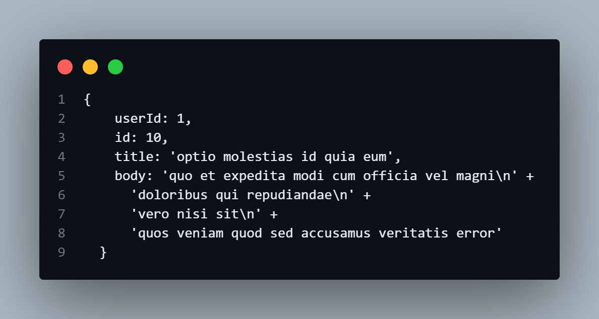
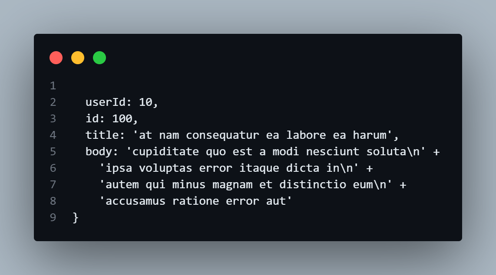
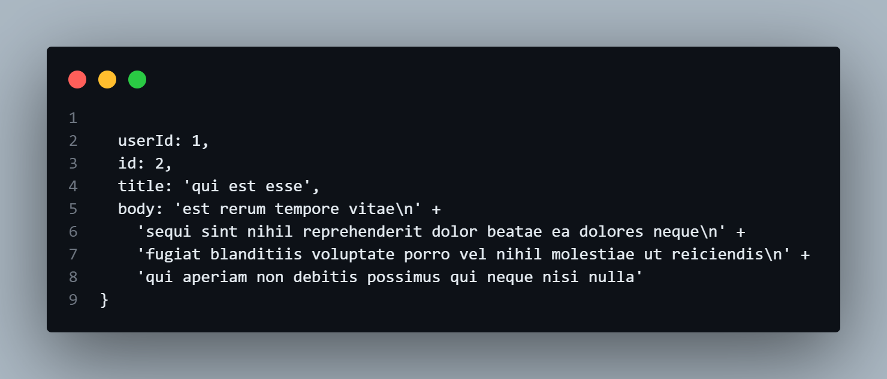
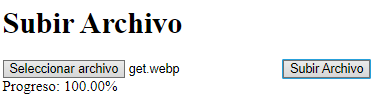

# Ejemplos Fetch API Avanzados

## Ejercicios Avanzados

### Paginación de Datos

Necesitamos obtener datos de una API paginada y mostrar los primeros 10 resultados.


```javascript
    // URL de la API con paginación
const url = 'https://jsonplaceholder.typicode.com/posts?_page=1&_limit=10';

// Realizar la solicitud GET
fetch(url)
    .then(response => {
        if (!response.ok) {
            throw new Error('Network response was not ok');
        }
        return response.json();
    })
    .then(data => {
        // Imprimir los primeros 10 resultados
        console.log(data);
    })
    .catch(error => {
        // Manejar errores
        console.error('Fetch error:', error);
    });

```

#### Explicación:
- fetch realiza una solicitud GET a una URL que incluye parámetros de paginación (_page=1 y _limit=10).

- Verifica si la respuesta es exitosa (response.ok).

- Convierte la respuesta a JSON y luego imprime los primeros 10 resultados.

- Captura y maneja cualquier error que ocurra durante la solicitud.

#### Resultado


### Autenticación con Tokens

Necesitamos hacer una solicitud GET autenticada usando un token Bearer.


```javascript
    // URL de la API protegida
const url = 'https://jsonplaceholder.typicode.com/posts';

// Token de autenticación
const token = 'Bearer your-token-here';

// Realizar la solicitud GET
fetch(url, {
    method: 'GET',
    headers: {
        'Authorization': token
    }
})
    .then(response => {
        if (!response.ok) {
            throw new Error('Network response was not ok');
        }
        return response.json();
    })
    .then(data => {
        // Imprimir los datos obtenidos
        console.log(data);
    })
    .catch(error => {
        // Manejar errores
        console.error('Fetch error:', error);
    });

```
#### Explicación:
- Define la URL de la API protegida.

- Crea un token de autenticación Bearer.

- Realiza una solicitud GET con el token en los headers.

- Verifica si la respuesta es exitosa (response.ok).

- Convierte la respuesta a JSON y luego imprime los datos obtenidos.

- Captura y maneja cualquier error que ocurra durante la solicitud.

#### Resultado


### Solicitudes Concurrentes:

Necesitamos realizar múltiples solicitudes concurrentes y manejar los resultados conjuntamente.

```javascript
    // URLs de las APIs
const urls = [
    'https://jsonplaceholder.typicode.com/posts/1',
    'https://jsonplaceholder.typicode.com/posts/2'
];

// Realizar solicitudes concurrentes
Promise.all(urls.map(url =>
    fetch(url).then(response => {
        if (!response.ok) {
            throw new Error('Network response was not ok');
        }
        return response.json();
    })
))
    .then(results => {
        // Imprimir los resultados de ambas solicitudes
        console.log(results);
    })
    .catch(error => {
        // Manejar errores
        console.error('Fetch error:', error);
    });

```

#### Explicación:
- Define un array con las URLs de las APIs.

- Usa Promise.all para realizar múltiples solicitudes concurrentes.

- Verifica si las respuestas son exitosas (response.ok).

- Convierte las respuestas a JSON.

- Imprime los resultados de ambas solicitudes.

- Captura y maneja cualquier error que ocurra durante las solicitudes.

#### Resultado


### Subida de Archivos con Progreso

Necesitamos subir un archivo a una API y mostrar el progreso de la subida.

```javascript
    // URL de la API
const url = 'https://jsonplaceholder.typicode.com/posts';

// Seleccionar el archivo
const fileInput = document.querySelector('input[type="file"]');
const file = fileInput.files[0];

// Crear FormData y añadir el archivo
const formData = new FormData();
formData.append('file', file);

// Crear una función para monitorear el progreso
function uploadProgress(event) {
    if (event.lengthComputable) {
        const percentComplete = (event.loaded / event.total) * 100;
        console.log(`Progreso: ${percentComplete.toFixed(2)}%`);
    }
}

// Crear un objeto XMLHttpRequest
const xhr = new XMLHttpRequest();
xhr.open('POST', url, true);

// Añadir evento de progreso
xhr.upload.addEventListener('progress', uploadProgress);

// Enviar los datos
xhr.send(formData);

// Manejar la respuesta
xhr.onload = function() {
    if (xhr.status === 200) {
        console.log('Archivo subido correctamente:', xhr.responseText);
    } else {
        console.error('Error en la subida:', xhr.statusText);
    }
};

// Manejar errores
xhr.onerror = function() {
    console.error('Error en la solicitud');
};

```

#### Explicación:
- Define la URL de la API.

- Selecciona el archivo del input del usuario.

- Crea un objeto FormData y añade el archivo.

- Define una función uploadProgress para monitorear el progreso de la subida.

- Crea un objeto XMLHttpRequest y configura la solicitud.

- Añade un evento para monitorear el progreso de la subida (xhr.upload.addEventListener('progress', uploadProgress)).

- Envía los datos con xhr.send(formData).

- Maneja la respuesta de la solicitud (xhr.onload).

- Captura y maneja cualquier error que ocurra durante la solicitud (xhr.onerror).

#### Resultado
