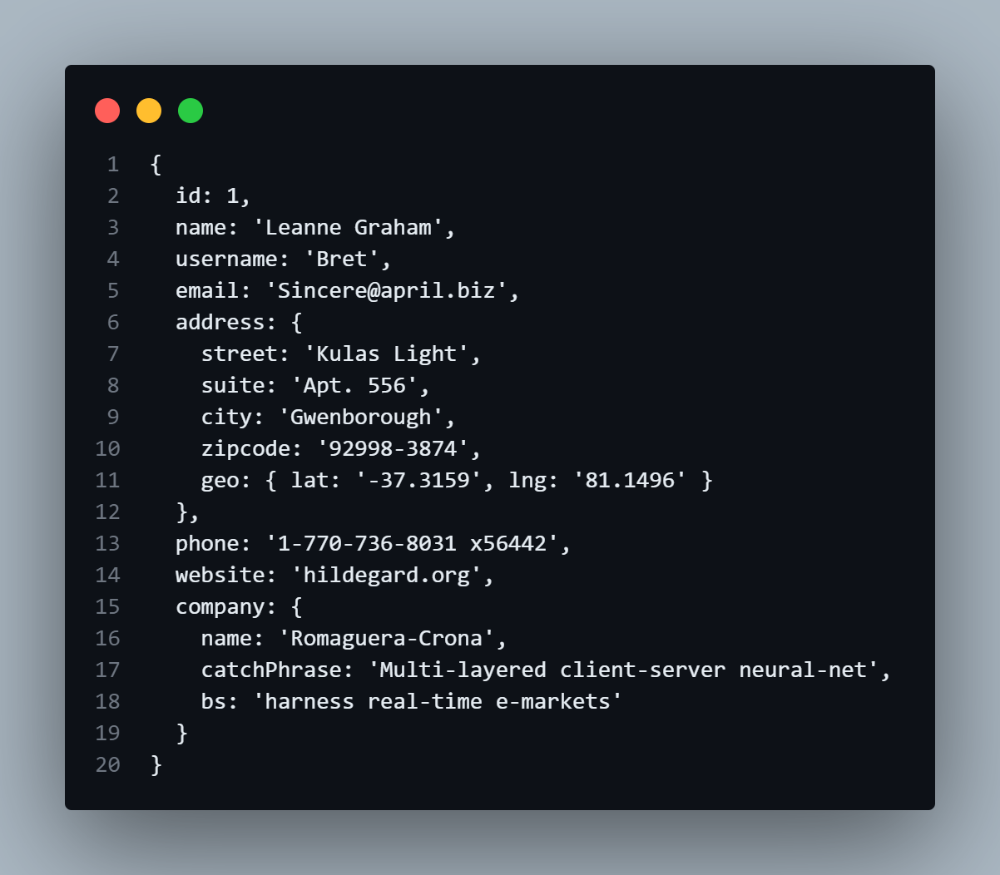
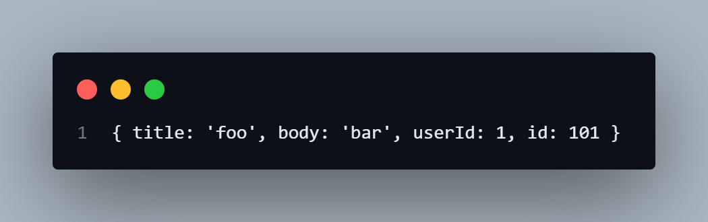
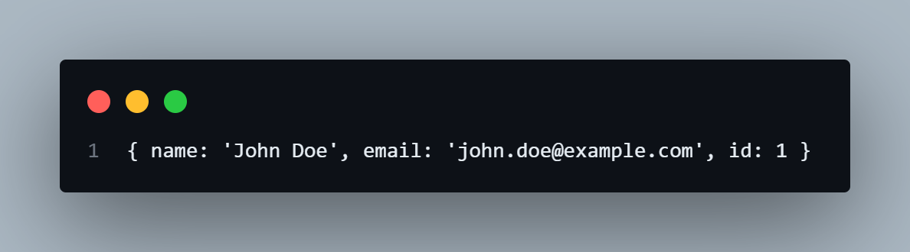
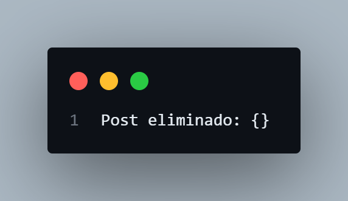

# Ejemplos Fetch API Sencillos

## Ejercicios Sencillos

### Solicitud GET para Obtener Datos de Usuario:

Obtener la información de un usuario específico de una API REST.

```javascript
// URL de la API
const url = 'https://jsonplaceholder.typicode.com/users/1';

// Realizar la solicitud GET
fetch(url)
    .then(response => {
        // Verificar si la respuesta es exitosa
        if (!response.ok) {
            throw new Error('Network response was not ok');
        }
        return response.json();
    })
    .then(data => {
        // Imprimir los datos del usuario
        console.log(data);
    })
    .catch(error => {
        // Manejar errores
        console.error('Fetch error:', error);
    });
```

#### Explicación:
- URL de la API: Definimos la URL de la API que contiene la información del usuario.

- fetch(url): Realiza la solicitud GET a la URL especificada.

- .then(response => ...): Verifica si la respuesta es exitosa (response.ok).
 
- .then(data => ...): Convierte la respuesta a formato JSON y luego imprime los datos del usuario.

- .catch(error => ...): Captura y maneja cualquier error que ocurra durante la solicitud.

#### Resultado


### Solicitud POST para Crear un Nuevo Post:

Realiza una solicitud GET y muestra los resultados en una lista en el DOM.


```javascript
    // URL de la API
const url = 'https://jsonplaceholder.typicode.com/posts';

// Datos del nuevo post
const newPost = {
    title: 'foo',
    body: 'bar',
    userId: 1
};

// Realizar la solicitud POST
fetch(url, {
    method: 'POST',
    headers: {
        'Content-Type': 'application/json; charset=UTF-8'
    },
    body: JSON.stringify(newPost)
})
    .then(response => {
        // Verificar si la respuesta es exitosa
        if (!response.ok) {
            throw new Error('Network response was not ok');
        }
        return response.json();
    })
    .then(data => {
        // Imprimir los datos del nuevo post
        console.log(data);
    })
    .catch(error => {
        // Manejar errores
        console.error('Fetch error:', error);
    });

```
#### Explicación:
- URL de la API: Definimos la URL de la API donde se creará el nuevo post.
- newPost: Definimos los datos del nuevo post que queremos crear.
- fetch(url, { " " }): Realiza la solicitud POST a la URL especificada con las opciones necesarias.
- method: 'POST': Especifica que la solicitud es de tipo POST.
- headers: Define los headers necesarios, en este caso para enviar datos JSON.
- body: JSON.stringify(newPost): Convierte el objeto newPost a una cadena JSON y lo envía en el cuerpo de la solicitud.
- .then(response => " "): Verifica si la respuesta es exitosa y convierte la respuesta a formato JSON.
- .then(data => " "): Imprime los datos del nuevo post.
- .catch(error => " "): Captura y maneja cualquier error que ocurra durante la solicitud.

#### Resultado


### Solicitud PUT para Actualizar Datos de Usuario:

Necesitamos actualizar la información de un usuario en una API REST.

```javascript
    // URL de la API
const url = 'https://jsonplaceholder.typicode.com/users/1';

// Datos actualizados del usuario
const updatedUser = {
    name: 'John Doe',
    email: 'john.doe@example.com'
};

// Realizar la solicitud PUT
fetch(url, {
    method: 'PUT',
    headers: {
        'Content-Type': 'application/json; charset=UTF-8'
    },
    body: JSON.stringify(updatedUser)
})
    .then(response => {
        // Verificar si la respuesta es exitosa
        if (!response.ok) {
            throw new Error('Network response was not ok');
        }
        return response.json();
    })
    .then(data => {
        // Imprimir los datos actualizados del usuario
        console.log(data);
    })
    .catch(error => {
        // Manejar errores
        console.error('Fetch error:', error);
    });
```

#### Explicación:
- URL de la API: Definimos la URL de la API que contiene la información del usuario a actualizar.

- updatedUser: Definimos los datos actualizados del usuario.

- fetch(url, { "" }): Realiza la solicitud PUT a la URL especificada con las opciones necesarias.

- method: 'PUT': Especifica que la solicitud es de tipo PUT.

- headers: Define los headers necesarios, en este caso para enviar datos JSON.

- body: JSON.stringify(updatedUser): Convierte el objeto updatedUser a una cadena JSON y lo envía en el cuerpo de la solicitud.

- .then(response => " "): Verifica si la respuesta es exitosa y convierte la respuesta a formato JSON.

- .then(data => " "): Imprime los datos actualizados del usuario.

- .catch(error => " "): Captura y maneja cualquier error que ocurra durante la solicitud.

#### Resultado


### Solicitud DELETE para Eliminar un Post

Necesitamos eliminar un post en una API REST.

```javascript
   // URL de la API
const url = 'https://jsonplaceholder.typicode.com/posts/1';

// Realizar la solicitud DELETE
fetch(url, {
    method: 'DELETE'
})
    .then(response => {
        // Verificar si la respuesta es exitosa
        if (!response.ok) {
            throw new Error('Network response was not ok');
        }
        return response.json();
    })
    .then(data => {
        // Imprimir confirmación de eliminación
        console.log('Post eliminado:', data);
    })
    .catch(error => {
        // Manejar errores
        console.error('Fetch error:', error);
    });

```

#### Explicación:
- URL de la API: Definimos la URL de la API que contiene el post a eliminar.

- fetch(url, { " " }): Realiza la solicitud DELETE a la URL especificada con las opciones necesarias.

- method: 'DELETE': Especifica que la solicitud es de tipo DELETE.

- .then(response => " "): Verifica si la respuesta es exitosa y convierte la respuesta a formato JSON.

- .then(data => " "): Imprime una confirmación de que el post fue eliminado.

- .catch(error => " "): Captura y maneja cualquier error que ocurra durante la solicitud.
 
#### Resultado
