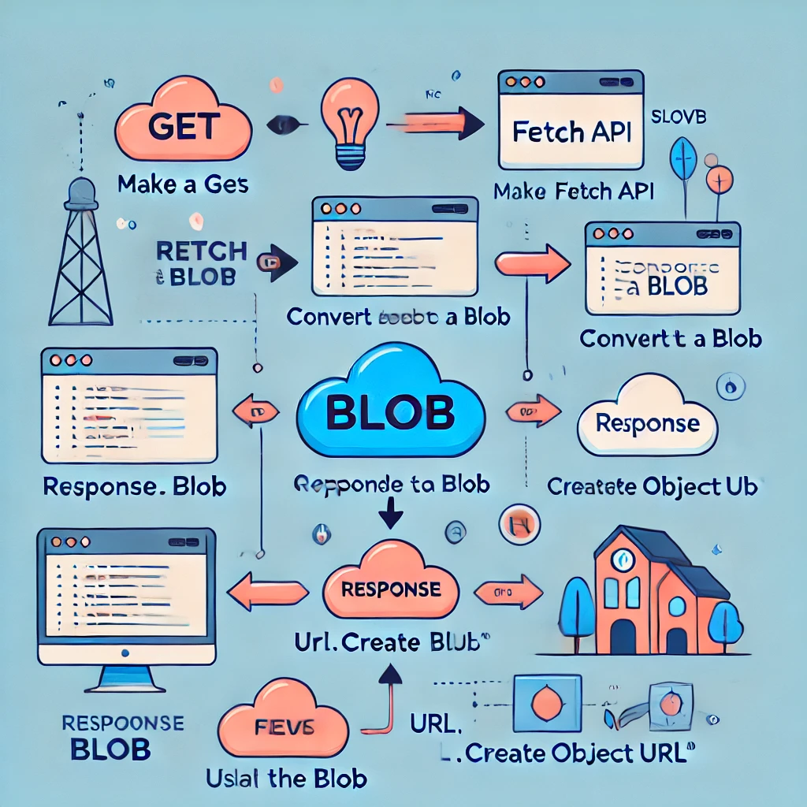

# Cómo obtener blobs de archivos o datos binarios con Fetch

### ¿Qué es un Blob?
Un Blob (Binary Large Object) es un conjunto de datos binarios como imágenes, archivos de video, o cualquier otro tipo de contenido que no sea texto. Los blobs son útiles cuando necesitas manejar archivos binarios grandes y puedes obtenerlos mediante la Fetch API.



### Obtener Blobs con Fetch
Para obtener un blob, puedes utilizar el método .blob() en la respuesta de una solicitud Fetch. Esto convierte la respuesta en un objeto Blob, que luego puede ser utilizado para descargar o mostrar archivos binarios, como imágenes o videos.


```js
fetch('https://example.com/image.jpg')
  .then(response => response.blob())
  .then(blob => {
    const imgURL = URL.createObjectURL(blob); // Convierte el Blob en una URL
    document.getElementById('imagen').src = imgURL; // Establece la imagen en un elemento 
  })
  .catch(error => console.error('Error al obtener el blob:', error));
```

### Explicación del código:

- fetch(): Realiza una solicitud GET para obtener un archivo de imagen.
- response.blob(): Convierte la respuesta en un objeto Blob.
- URL.createObjectURL(blob): Convierte el Blob en una URL que puede ser utilizada por el navegador.
- document.getElementById('imagen').src: Asigna la URL del Blob al atributo src de un elemento "img" en el DOM para mostrar la imagen.