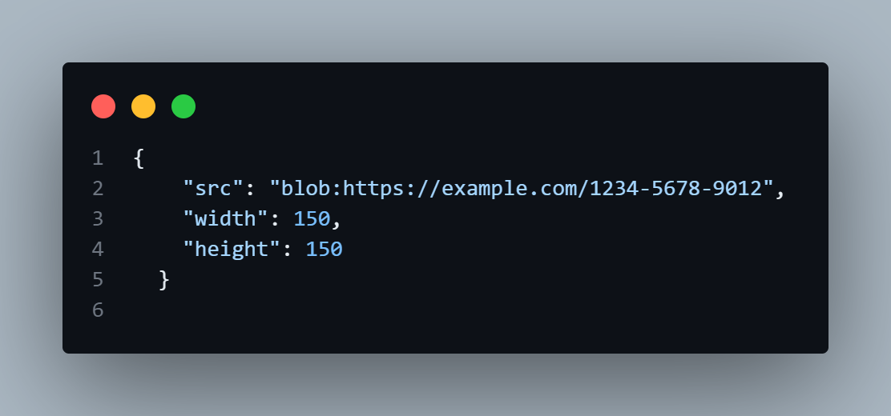
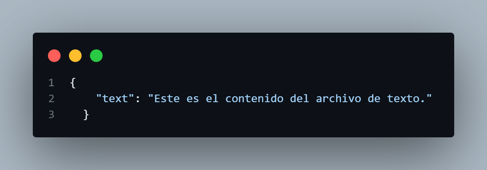
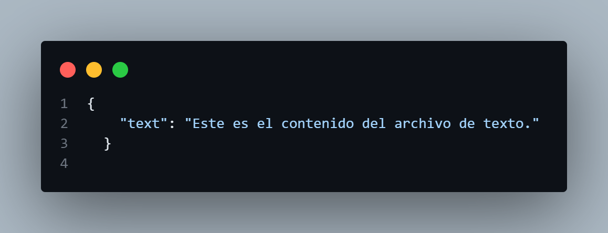
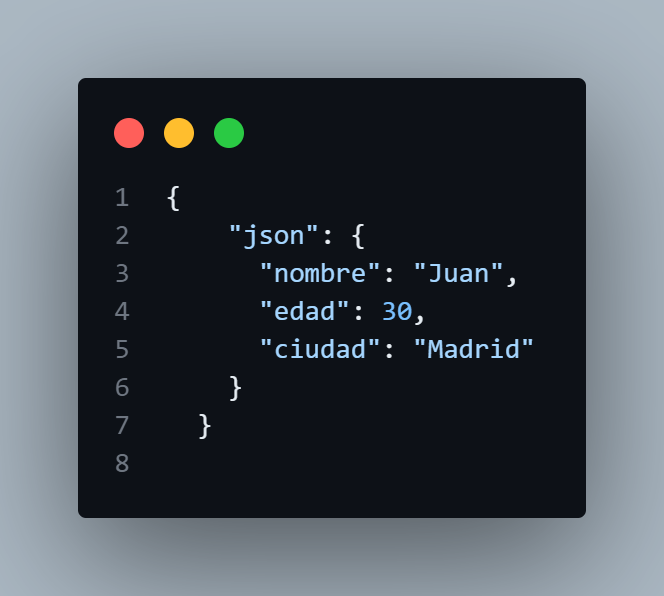

# Ejemplos Fetch Blobs Sencillos

## Ejercicios Sencillos

### Descargar una Imagen
Queremos descargar una imagen desde una URL y mostrarla en la página web.

```html
    <h1>Descargar Imagen</h1>
    <button onclick="downloadImage()">Descargar Imagen</button>
    <div id="image-container"></div>

```
```javascript
    function downloadImage() {
            const url = 'https://via.placeholder.com/150'; // URL de la imagen

            fetch(url)
                .then(response => response.blob()) // Convertir la respuesta a un blob
                .then(blob => {
                    const url = URL.createObjectURL(blob); // Crear una URL para el blob
                    const img = document.createElement('img'); // Crear un elemento img
                    img.src = url; // Asignar la URL al src del img
                    document.querySelector('#image-container').appendChild(img); // Añadir la imagen al contenedor
                })
                .catch(error => console.error('Error:', error)); // Manejar errores
        }
```
#### Explicación:

- Define la URL de la imagen.

- Realiza una solicitud fetch para obtener la imagen.

- Convierte la respuesta a un blob con response.blob().

- Crea una URL para el blob con URL.createObjectURL(blob).

- Crea un elemento img y asigna la URL al src.

- Añade la imagen al contenedor en el DOM.

- Captura y maneja cualquier error que ocurra.

#### Resultado


### Descargar un Archivo de Texto
Queremos descargar un archivo de texto desde una URL y mostrar su contenido.

```html
    <h1>Descargar Archivo de Texto</h1>
    <button onclick="downloadTextFile()">Descargar Archivo</button>
    <pre id="text-container"></pre>

```

```javascript
    // Realiza una solicitud para descargar un archivo y lo guarda en el dispositivo
    function downloadTextFile() {
            const url = 'https://example.com/file.txt'; // URL del archivo de texto

            fetch(url)
                .then(response => response.blob()) // Convertir la respuesta a un blob
                .then(blob => blob.text()) // Convertir el blob a texto
                .then(text => {
                    document.querySelector('#text-container').textContent = text; // Mostrar el texto en el contenedor
                })
                .catch(error => console.error('Error:', error)); // Manejar errores
        }
```
#### Explicación:

- Define la URL del archivo de texto.

- Realiza una solicitud fetch para obtener el archivo.

- Convierte la respuesta a un blob con response.blob().

- Convierte el blob a texto con blob.text().

- Muestra el texto en un contenedor en el DOM.

- Captura y maneja cualquier error que ocurra.

#### Resultado


### Descargar un PDF
Queremos descargar un archivo PDF desde una URL y mostrarlo en la página.

```html
    <h1>Descargar PDF</h1>
    <button onclick="downloadPDF()">Descargar PDF</button>
    <iframe id="pdf-container" width="100%" height="500px"></iframe>
```

```javascript
    function downloadPDF() {
            const url = 'https://example.com/file.pdf'; // URL del archivo PDF

            fetch(url)
                .then(response => response.blob()) // Convertir la respuesta a un blob
                .then(blob => {
                    const url = URL.createObjectURL(blob); // Crear una URL para el blob
                    document.querySelector('#pdf-container').src = url; // Asignar la URL al src del iframe
                })
                .catch(error => console.error('Error:', error)); // Manejar errores
        }
```
#### Explicación:

- Define la URL del archivo PDF.

- Realiza una solicitud fetch para obtener el archivo.

- Convierte la respuesta a un blob con response.blob().

- Crea una URL para el blob con URL.createObjectURL(blob).

- Asigna la URL al src de un iframe para mostrar el PDF.

- Captura y maneja cualquier error que ocurra.

#### Resultado


### Descargar un Archivo JSON
Queremos descargar un archivo JSON desde una URL y mostrar su contenido.
```html
    <h1>Descargar JSON</h1>
    <button onclick="downloadJSON()">Descargar JSON</button>
    <pre id="json-container"></pre>
```


```javascript
    function downloadJSON() {
            const url = 'https://example.com/data.json'; // URL del archivo JSON

            fetch(url)
                .then(response => response.blob()) // Convertir la respuesta a un blob
                .then(blob => blob.text()) // Convertir el blob a texto
                .then(text => JSON.parse(text)) // Convertir el texto a un objeto JSON
                .then(json => {
                    document.querySelector('#json-container').textContent = JSON.stringify(json, null, 2); // Mostrar el JSON en el contenedor
                })
                .catch(error => console.error('Error:', error)); // Manejar errores
        }
```
#### Explicación:

- Define la URL del archivo JSON.

- Realiza una solicitud fetch para obtener el archivo.

- Convierte la respuesta a un blob con response.blob().

- Convierte el blob a texto con blob.text().

- Convierte el texto a un objeto JSON con JSON.parse(text).

- Muestra el JSON en un contenedor en el DOM.

- Captura y maneja cualquier error que ocurra.

#### Resultado
