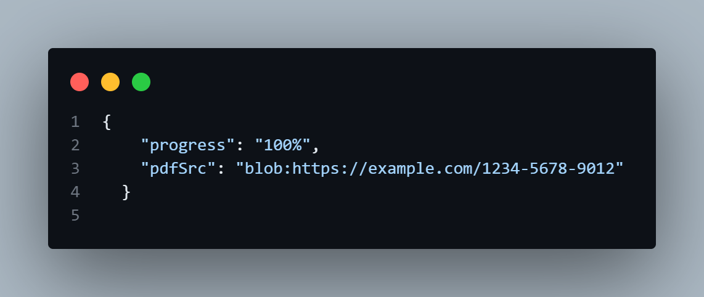
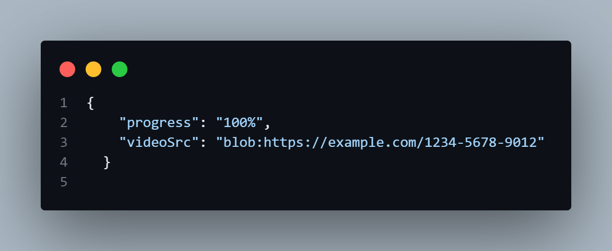
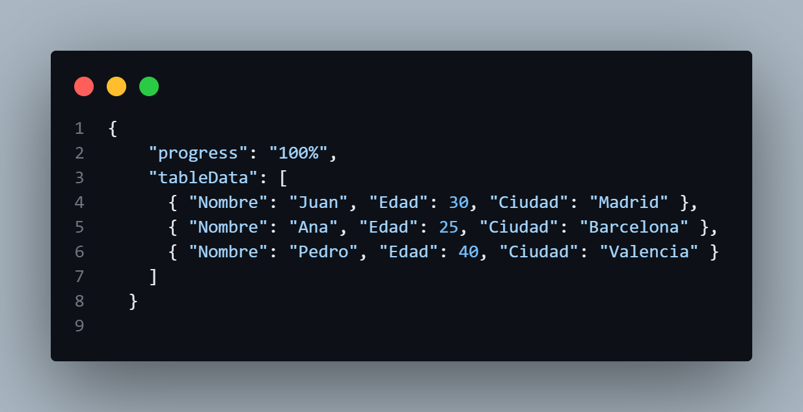

# Ejemplos Fetch Blobs Avanzados
## Ejercicios Avanzados
### Descargar y Mostrar una Imagen con Progreso
Queremos descargar una imagen desde una URL, mostrar el progreso de la descarga y luego mostrar la imagen en la página.

```html
    <h1>Descargar Imagen con Progreso</h1>
    <button onclick="downloadImageWithProgress()">Descargar Imagen</button>
    <progress id="progress" value="0" max="100"></progress>
    <div id="image-container"></div>
```

```javascript
    function downloadImageWithProgress() {
            const url = 'https://via.placeholder.com/150'; // URL de la imagen

            fetch(url)
                .then(response => {
                    const contentLength = response.headers.get('Content-Length'); // Obtener la longitud del contenido
                    if (!contentLength) {
                        throw new Error('No se puede determinar el tamaño del contenido');
                    }

                    const reader = response.body.getReader();
                    let receivedLength = 0;
                    const chunks = [];

                    return reader.read().then(function processResult(result) {
                        if (result.done) {
                            const blob = new Blob(chunks); // Crear un blob a partir de los chunks
                            return blob;
                        }

                        chunks.push(result.value);
                        receivedLength += result.value.length;

                        const progress = (receivedLength / contentLength) * 100;
                        document.querySelector('#progress').value = progress;

                        return reader.read().then(processResult);
                    });
                })
                .then(blob => {
                    const url = URL.createObjectURL(blob); // Crear una URL para el blob
                    const img = document.createElement('img'); // Crear un elemento img
                    img.src = url; // Asignar la URL al src del img
                    document.querySelector('#image-container').appendChild(img); // Añadir la imagen al contenedor
                })
                .catch(error => console.error('Error:', error)); // Manejar errores
        }
```
#### Explicación:

- Define la URL de la imagen.

- Realiza una solicitud fetch para obtener la imagen.

- Obtiene la longitud del contenido desde los headers de la respuesta.

- Usa el método getReader para leer el cuerpo de la respuesta como un stream.

- Lee el stream en chunks y actualiza el progreso.

- Crea un blob a partir de los chunks.

- Crea una URL para el blob con URL.createObjectURL(blob).

- Crea un elemento img y asigna la URL al src.

- Añade la imagen al contenedor en el DOM.

- Captura y maneja cualquier error que ocurra.
#### Resultado


### Descargar y Mostrar un PDF con Progreso
Queremos descargar un archivo PDF desde una URL, mostrar el progreso de la descarga y luego mostrar el PDF en la página.

```html
    <h1>Descargar PDF con Progreso</h1>
    <button onclick="downloadPDFWithProgress()">Descargar PDF</button>
    <progress id="progress" value="0" max="100"></progress>
    <iframe id="pdf-container" width="100%" height="500px"></iframe>
```
```javascript
    function downloadPDFWithProgress() {
            const url = 'https://example.com/file.pdf'; // URL del archivo PDF

            fetch(url)
                .then(response => {
                    const contentLength = response.headers.get('Content-Length'); // Obtener la longitud del contenido
                    if (!contentLength) {
                        throw new Error('No se puede determinar el tamaño del contenido');
                    }

                    const reader = response.body.getReader();
                    let receivedLength = 0;
                    const chunks = [];

                    return reader.read().then(function processResult(result) {
                        if (result.done) {
                            const blob = new Blob(chunks, { type: 'application/pdf' }); // Crear un blob a partir de los chunks
                            return blob;
                        }

                        chunks.push(result.value);
                        receivedLength += result.value.length;

                        const progress = (receivedLength / contentLength) * 100;
                        document.querySelector('#progress').value = progress;

                        return reader.read().then(processResult);
                    });
                })
                .then(blob => {
                    const url = URL.createObjectURL(blob); // Crear una URL para el blob
                    document.querySelector('#pdf-container').src = url; // Asignar la URL al src del iframe
                })
                .catch(error => console.error('Error:', error)); // Manejar errores
        }
```
#### Explicación:

- Define la URL del archivo PDF.

- Realiza una solicitud fetch para obtener el archivo.

- Obtiene la longitud del contenido desde los headers de la respuesta.

- Usa el método getReader para leer el cuerpo de la respuesta como un stream.

- Lee el stream en chunks y actualiza el progreso.

- Crea un blob a partir de los chunks y especifica el tipo como application/pdf.

- Crea una URL para el blob con URL.createObjectURL(blob).

- Asigna la URL al src de un iframe para mostrar el PDF.

- Captura y maneja cualquier error que ocurra.

#### Resultado


### Descargar y Mostrar un Video con Progreso
Queremos descargar un archivo de video desde una URL, mostrar el progreso de la descarga y luego mostrar el video en la página.

```html
    <h1>Descargar Video con Progreso</h1>
    <button onclick="downloadVideoWithProgress()">Descargar Video</button>
    <progress id="progress" value="0" max="100"></progress>
    <video id="video-container" width="100%" controls>
```
```javascript
    function downloadVideoWithProgress() {
            const url = 'https://example.com/video.mp4'; // URL del archivo de video

            fetch(url)
                .then(response => {
                    const contentLength = response.headers.get('Content-Length'); // Obtener la longitud del contenido
                    if (!contentLength) {
                        throw new Error('No se puede determinar el tamaño del contenido');
                    }

                    const reader = response.body.getReader();
                    let receivedLength = 0;
                    const chunks = [];

                    return reader.read().then(function processResult(result) {
                        if (result.done) {
                            const blob = new Blob(chunks, { type: 'video/mp4' }); // Crear un blob a partir de los chunks
                            return blob;
                        }

                        chunks.push(result.value);
                        receivedLength += result.value.length;

                        const progress = (receivedLength / contentLength) * 100;
                        document.querySelector('#progress').value = progress;

                        return reader.read().then(processResult);
                    });
                })
                .then(blob => {
                    const url = URL.createObjectURL(blob); // Crear una URL para el blob
                    document.querySelector('#video-container').src = url; // Asignar la URL al src del video
                })
                .catch(error => console.error('Error:', error)); // Manejar errores
        }
```
#### Explicación:

- Define la URL del archivo de video.

- Realiza una solicitud fetch para obtener el archivo.

- Obtiene la longitud del contenido desde los headers de la respuesta.

- Usa el método getReader para leer el cuerpo de la respuesta como un stream.

- Lee el stream en chunks y actualiza el progreso.

- Crea un blob a partir de los chunks y especifica el tipo como video/mp4.

- Crea una URL para el blob con URL.createObjectURL(blob).

- Asigna la URL al src de un elemento video para mostrar el video.

- Captura y maneja cualquier error que ocurra.
 
#### Resultado


### Descargar y Procesar un Archivo CSV
Queremos descargar un archivo CSV desde una URL, procesar su contenido y mostrarlo en una tabla HTML.

```html
   <h1>Descargar CSV y Mostrar en Tabla</h1>
    <button onclick="downloadCSV()">Descargar CSV</button>
    <table id="csv-table">
        <thead>
            <tr id="csv-header"></tr>
        </thead>
        <tbody id="csv-body"></tbody>
    </table>
```
```javascript
    function downloadCSV() {
            const url = 'https://example.com/data.csv'; // URL del archivo CSV

            fetch(url)
                .then(response => response.text()) // Convertir la respuesta a texto
                .then(csvText => {
                    const rows = csvText.split('\n'); // Dividir el texto en filas
                    const header = rows[0].split(','); // Obtener los encabezados
                    const bodyRows = rows.slice(1); // Obtener las filas del cuerpo

                    // Crear y añadir los encabezados a la tabla
                    const headerRow = document.getElementById('csv-header');
                    header.forEach(headerCell => {
                        const th = document.createElement('th');
                        th.textContent = headerCell;
                        headerRow.appendChild(th);
                    });

                    // Crear y añadir las filas del cuerpo a la tabla
                    const body = document.getElementById('csv-body');
                    bodyRows.forEach(row => {
                        const tr = document.createElement('tr');
                        const cells = row.split(',');
                        cells.forEach(cell => {
                            const td = document.createElement('td');
                            td.textContent = cell;
                            tr.appendChild(td);
                        });
                        body.appendChild(tr);
                    });
                })
                .catch(error => console.error('Error:', error)); // Manejar errores
        }
```
#### Explicación:

- downloadCSV Function: Define una función para descargar y procesar el archivo CSV.

- fetch(url): Realiza una solicitud GET a la URL especificada.

- .then(response => response.text()): Convierte la respuesta a texto.

- const rows = csvText.split('\n');: Divide el texto del CSV en filas usando el carácter de nueva línea.

- const header = rows[0].split(',');: Divide la primera fila en encabezados usando la coma como delimitador.

- const bodyRows = rows.slice(1);: Obtiene las filas del cuerpo, excluyendo la fila de encabezado.

- const headerRow = document.getElementById('csv-header');: Selecciona el elemento donde se añadirán los encabezados.

- header.forEach(headerCell => { "" });: Itera sobre los encabezados y crea elementos th para cada uno, añadiéndolos a la fila de encabezado.

- const body = document.getElementById('csv-body');: Selecciona el elemento donde se añadirán las filas del cuerpo.

- bodyRows.forEach(row => { "" });: Itera sobre las filas del cuerpo, creando elementos tr y td para cada celda, y añadiéndolos a la tabla.

- .catch(error => console.error('Error:', error));: Captura y maneja cualquier error que ocurra durante la solicitud.
#### Resultado

