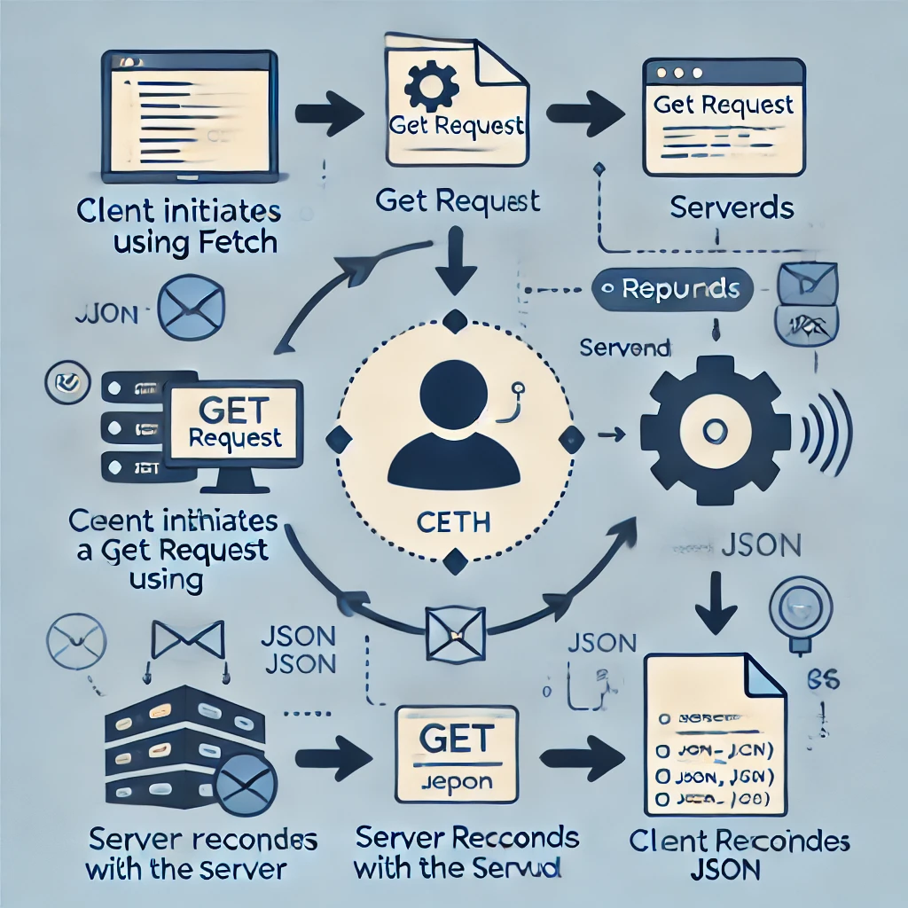

# Cómo realizar solicitudes HTTP GET

### ¿Qué es una Solicitud GET?

Las solicitudes HTTP **GET** son utilizadas para recuperar datos desde un servidor sin modificar nada en él. Son las solicitudes más comunes y simples de realizar. Con la **Fetch API**, las solicitudes GET se realizan por defecto, por lo que no es necesario especificar el método a menos que quieras configuraciones adicionales.



### Realizar una Solicitud HTTP GET con Fetch

El siguiente ejemplo muestra cómo realizar una solicitud GET para obtener datos de una API y luego procesarlos en formato JSON:

```javascript
fetch('https://api.example.com/data')
  .then(response => {
    if (!response.ok) {
      throw new Error('Error en la solicitud');
    }
    return response.json(); // Convierte la respuesta en formato JSON
  })
  .then(data => console.log(data)) // Maneja los datos recibidos
  .catch(error => console.error('Hubo un problema con la solicitud:', error)); // Maneja errores
```

### Explicación del código:

- **fetch()**: Realiza la solicitud a la URL proporcionada.
- **response.ok**: Verifica si la respuesta fue exitosa (código de estado entre 200-299).
- **response.json()**: Convierte la respuesta en formato JSON, que es un formato de datos muy común para las APIs.
- **.then()**: Maneja los datos recibidos de manera asíncrona.
- **.catch()**: Captura cualquier error que ocurra durante la solicitud.
