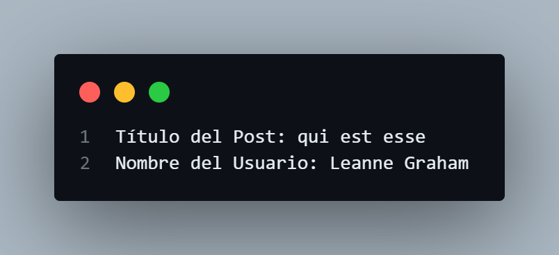

# Ejemplos Get request Sencillos

### Ejercicios Sencillos

### Obtener información sobre un álbum

Realiza una solicitud GET para obtener información sobre un álbum específico y muestra su título.

```javascript
    // Realiza una solicitud GET a la API para obtener información sobre un álbum específico
    fetch('https://jsonplaceholder.typicode.com/albums/1')
        .then(response => response.json()) // Convierte la respuesta a formato JSON
        .then(data => {
            // Muestra el título del álbum en la consola
            console.log('Título del álbum:', data.title);
        })
        .catch(error => {
            // Maneja cualquier error que ocurra durante la solicitud
            console.error('Error:', error);
        });

```
##### Explicación:

- fetch(): Se hace una solicitud a la URL especificada para obtener información sobre un álbum con ID 1.
- response.json(): Convierte la respuesta en formato JSON.
- console.log(): Imprime el título del álbum en la consola.
- catch(): Captura y muestra cualquier error en caso de que la solicitud falle.

#### Resultado


### Obtener una lista de fotos
Haz una solicitud GET para obtener una lista de fotos y muestra la URL de cada una en la consola.


```javascript
    // Realiza una solicitud GET para obtener una lista de fotos
    fetch('https://jsonplaceholder.typicode.com/photos')
        .then(response => response.json()) // Convierte la respuesta a formato JSON
        .then(data => {
            // Itera a través de cada foto y muestra la URL en la consola
            data.forEach(photo => {
                console.log('URL de la foto:', photo.url);
            });
        })
        .catch(error => {
            // Maneja cualquier error que ocurra durante la solicitud
            console.error('Error:', error);
        });

```
#### Explicación:

- fetch(): Realiza una solicitud para obtener todas las fotos disponibles.
- response.json(): Convierte la respuesta a JSON.
- data.forEach(): Itera a través de cada foto y muestra la URL en la consola.
- catch(): Maneja cualquier error que pueda ocurrir durante la solicitud.

#### Resultado


### Obtener detalles de un post y su usuario
Realiza una solicitud GET para obtener un post y muestra también el nombre del usuario que lo creó.

javascript
```javascript
    // Define un ID de post para buscar
    const postId = 2; // ID 

    // Realiza una solicitud GET para obtener el post correspondiente
    fetch(`https://jsonplaceholder.typicode.com/posts/${postId}`)
        .then(response => response.json()) // Convierte la respuesta a formato JSON
        .then(post => {
            // Muestra el título del post en la consola
            console.log('Título del Post:', post.title);
            // Realiza otra solicitud GET para obtener información del usuario que creó el post
            return fetch(`https://jsonplaceholder.typicode.com/users/${post.userId}`);
        })
        .then(response => response.json()) // Convierte la respuesta a formato JSON
        .then(user => {
            // Muestra el nombre del usuario en la consola
            console.log('Nombre del Usuario:', user.name);
        })
        .catch(error => {
            // Maneja cualquier error que ocurra durante las solicitudes
            console.error('Error:', error);
        });

```
#### Explicación:

- Se define un ID para el post.
- fetch(): Se hace una solicitud para obtener el post correspondiente.
- response.json(): Convierte la respuesta a JSON.
- console.log(): Muestra el título del post.
- Se realiza una segunda solicitud para obtener información del usuario que creó el post usando el userId del post.
- Se imprime el nombre del usuario en la consola.
- catch(): Captura errores en cualquiera de las solicitudes.

#### Resultado



### Obtener información de múltiples recursos
Realiza una solicitud GET para obtener tanto usuarios como publicaciones, y muestra sus títulos.

```javascript
        // Realiza múltiples solicitudes GET para obtener usuarios y posts
    Promise.all([
        fetch('https://jsonplaceholder.typicode.com/users'), // Solicitud para obtener usuarios
        fetch('https://jsonplaceholder.typicode.com/posts')  // Solicitud para obtener posts
    ])
    .then(responses => 
        // Convierte todas las respuestas a formato JSON
        Promise.all(responses.map(response => response.json()))
    )
    .then(data => {
        // Desestructura el array de respuestas
        const [users, posts] = data;
        // Muestra los nombres de los usuarios en la consola
        console.log('Usuarios:', users.map(user => user.name));
        // Muestra los títulos de las publicaciones en la consola
        console.log('Títulos de Publicaciones:', posts.map(post => post.title));
    })
    .catch(error => {
        // Maneja cualquier error que ocurra durante las solicitudes
        console.error('Error:', error);
    });

```
#### Explicación:

- Promise.all(): Se utiliza para realizar múltiples solicitudes simultáneamente (una para usuarios y otra para publicaciones).
- fetch(): Se hace una solicitud para cada recurso.
- Promise.all(): Espera a que ambas solicitudes se completen y convierte ambas respuestas a JSON.
- const [users, posts] = data;: Desestructura el array de respuestas.
- Se imprimen los nombres de los usuarios y los títulos de las publicaciones.
- catch(): Maneja cualquier error que pueda ocurrir.

#### Resultado


