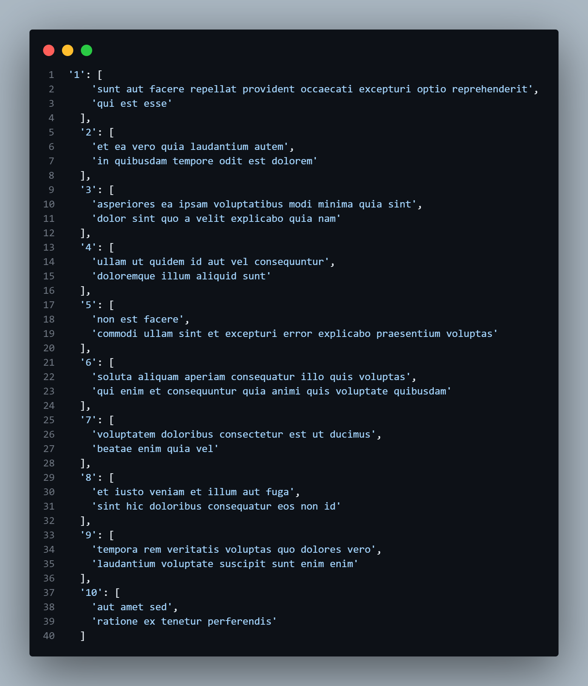
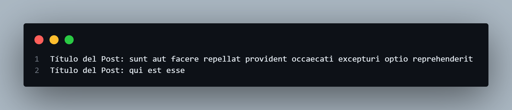
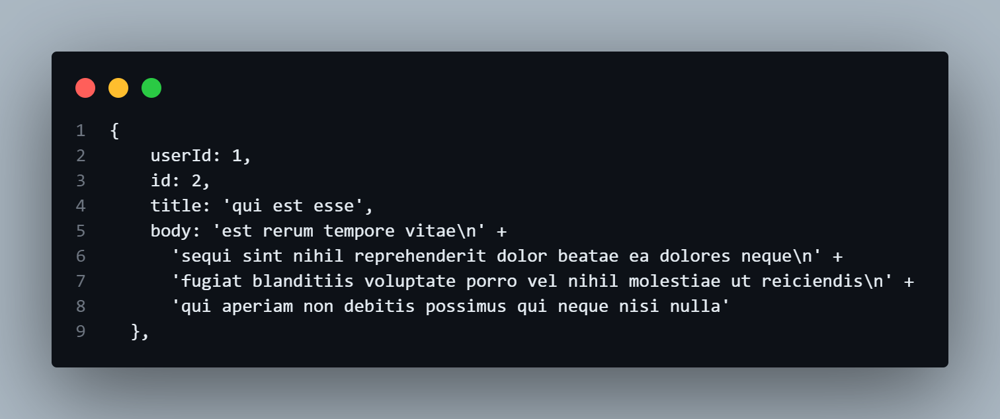
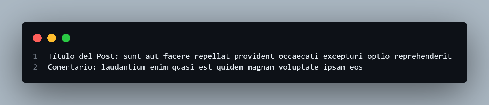

# Ejemplos Get request Avanzados

### Ejercicios Avanzados

### Obtener publicaciones y mostrar por autor
 Realiza una solicitud GET para obtener publicaciones y agrégalas por autor. Muestra el nombre del autor seguido de sus publicaciones.
 
```javascript
    // Realiza una solicitud GET para obtener todas las publicaciones
    fetch('https://jsonplaceholder.typicode.com/posts')
        .then(response => response.json()) // Convierte la respuesta a formato JSON
        .then(posts => {
            // Agrupa las publicaciones por autor utilizando reduce
            const groupedByUser = posts.reduce((acc, post) => {
                acc[post.userId] = acc[post.userId] || []; // Inicializa el array si no existe
                acc[post.userId].push(post.title); // Agrega el título al array correspondiente
                return acc; // Devuelve el acumulador
            }, {});
            // Muestra las publicaciones agrupadas por autor en la consola
            console.log('Publicaciones agrupadas por autor:', groupedByUser);
        })
        .catch(error => {
            // Maneja cualquier error que ocurra durante la solicitud
            console.error('Error:', error);
        });

```
#### Explicación:

- fetch(): Realiza una solicitud para obtener todas las publicaciones.
- response.json(): Convierte la respuesta a JSON.
- posts.reduce(): Agrupa las publicaciones por userId en un objeto, donde cada clave es un ID de usuario y cada valor es un array de títulos de publicaciones.
- console.log(): Imprime el objeto agrupado en la consola.
- catch(): Captura y maneja errores.

#### Resultado



### Implementar paginación
Realiza una solicitud GET para obtener publicaciones y permite la paginación. Carga 5 publicaciones a la vez.
```javascript
    let currentPage = 0; // Página actual
    const pageSize = 5; // Número de publicaciones por página

    // Función para cargar las publicaciones
    const loadPosts = () => {
        // Realiza una solicitud GET para obtener publicaciones de la página actual
        fetch(`https://jsonplaceholder.typicode.com/posts?_page=${currentPage + 1}&_limit=${pageSize}`)
            .then(response => response.json()) // Convierte la respuesta a formato JSON
            .then(posts => {
                // Muestra los títulos de las publicaciones en la consola
                posts.forEach(post => console.log('Título del Post:', post.title));
                currentPage++; // Incrementa la página actual
            })
            .catch(error => {
                // Maneja cualquier error que ocurra durante la solicitud
                console.error('Error:', error);
            });
    };

    // Carga inicial de publicaciones
    loadPosts(); // Llama a la función para cargar publicaciones

    // Simula un clic para cargar más publicaciones después de 2 segundos
    setTimeout(loadPosts, 2000); 

```
#### Explicación:

- Se definen currentPage y pageSize para manejar la paginación.
- loadPosts(): Función que realiza una solicitud GET para cargar publicaciones de la página actual.
- ?_page= y &_limit=: Se utilizan parámetros de consulta para especificar la página y el límite de resultados.
- posts.forEach(): Imprime los títulos de las publicaciones en la consola.
- setTimeout(): Simula un clic al cargar más publicaciones después de 2 segundos.

#### Resultado



### Buscar publicaciones por palabra clave
Realiza una solicitud GET y permite que el usuario busque publicaciones por una palabra clave en el título.
```javascript
    // Define una palabra clave para buscar en los títulos de las publicaciones
const searchKeyword = 'qui'; // Cambia esta variable por cualquier palabra clave

// Realiza una solicitud GET para obtener todas las publicaciones
    fetch('https://jsonplaceholder.typicode.com/posts')
        .then(response => response.json()) // Convierte la respuesta a formato JSON
        .then(posts => {
            // Filtra las publicaciones que contienen la palabra clave en el título
            const filteredPosts = posts.filter(post => post.title.toLowerCase().includes(searchKeyword.toLowerCase()));
            // Muestra las publicaciones encontradas en la consola
            console.log('Publicaciones encontradas:', filteredPosts);
        })
        .catch(error => {
            // Maneja cualquier error que ocurra durante la solicitud
            console.error('Error:', error);
        });

```
#### Explicación:

- Se define una palabra clave para buscar en los títulos.
- fetch(): Realiza una solicitud para obtener todas las publicaciones.
- posts.filter(): Filtra las publicaciones que contienen la palabra clave en el título, ignorando mayúsculas y minúsculas.
- console.log(): Imprime las publicaciones filtradas en la consola.
- catch(): Captura errores.

#### Resultado



### Obtener la primera publicación y sus comentarios
Haz una solicitud GET para obtener la primera publicación y luego otra para obtener sus comentarios.
```javascript
// Realiza una solicitud GET para obtener la primera publicación
    fetch('https://jsonplaceholder.typicode.com/posts/1')
        .then(response => response.json()) // Convierte la respuesta a formato JSON
        .then(post => {
            // Muestra el título del post en la consola
            console.log('Título del Post:', post.title);
            // Realiza otra solicitud GET para obtener los comentarios del post
            return fetch(`https://jsonplaceholder.typicode.com/comments?postId=${post.id}`);
        })
        .then(response => response.json()) // Convierte la respuesta a formato JSON
        .then(comments => {
            // Itera sobre los comentarios e imprime cada uno en la consola
            comments.forEach(comment => console.log('Comentario:', comment.body));
        })
        .catch(error => {
            // Maneja cualquier error que ocurra durante las solicitudes
            console.error('Error:', error);
        });

```

#### Explicación:

- fetch(): Realiza una solicitud para obtener la primera publicación.
- response.json(): Convierte la respuesta a JSON.
- console.log(): Muestra el título de la publicación.
- Se hace otra solicitud para obtener los comentarios que pertenecen a la publicación usando su ID.
- comments.forEach(): Itera sobre los comentarios e imprime cada uno en la consola.
- catch(): Maneja errores en cualquiera de las solicitudes.

#### Resultado


