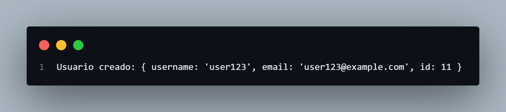
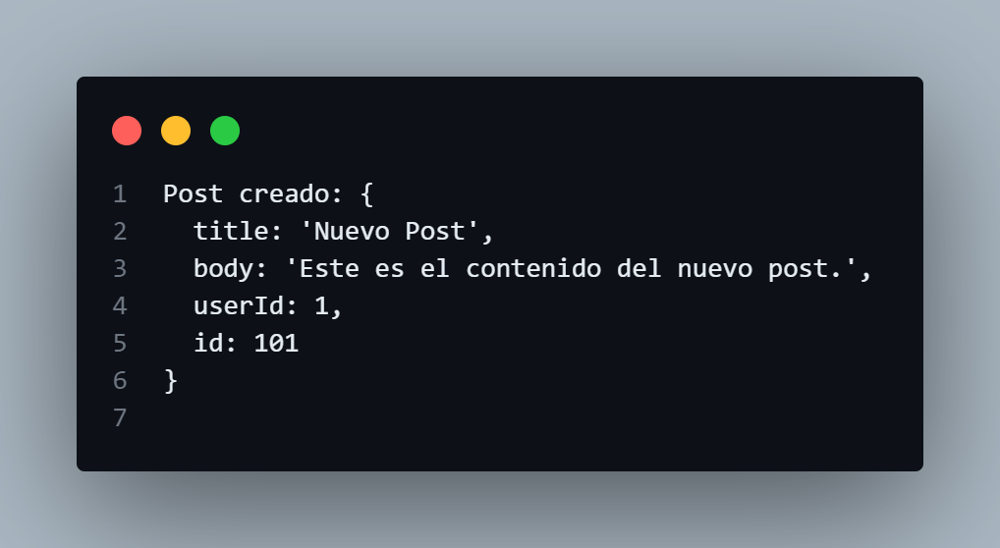
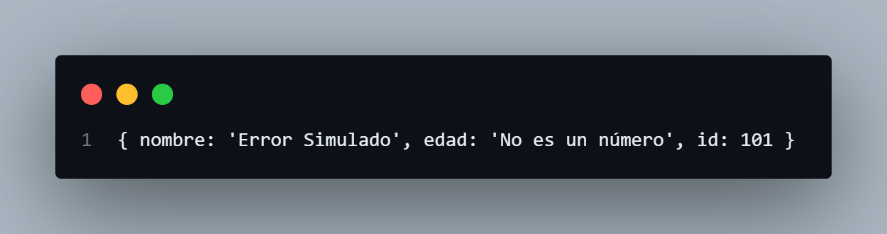
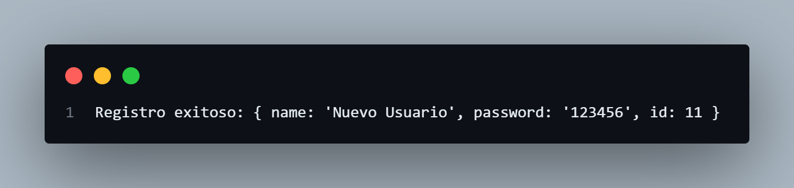

# Ejemplos POST requests Sencillos

## Ejercicios Sencillos
### Enviar Datos Simples
Necesitamos enviar un objeto JSON simple a una API y manejar la respuesta.

```javascript
        // Define un objeto que contiene los datos a enviar
    const data = {
        name: "John Doe",  // Nombre del usuario
        age: 30            // Edad del usuario
    };

    // Realiza una solicitud POST para enviar el objeto JSON a la API
    fetch('https://jsonplaceholder.typicode.com/posts', {
        method: 'POST', // Método de la solicitud
        body: JSON.stringify(data), // Convierte el objeto a una cadena JSON
        headers: {
            'Content-Type': 'application/json' // Especifica el tipo de contenido que se está enviando
        }
    })
    .then(response => response.json()) // Convierte la respuesta a formato JSON
    .then(responseData => {
        // Muestra la respuesta de la API en la consola
        console.log('Respuesta del servidor:', responseData);
    })
    .catch(error => {
        // Maneja cualquier error que ocurra durante la solicitud
        console.error('Error:', error);
    });

```
#### Explicación:

- Se crea un objeto data con la información que queremos enviar.
- Usamos fetch con el método POST y convertimos data a una cadena JSON utilizando JSON.stringify().
- Establecemos el encabezado Content-Type para indicar que el contenido enviado es de tipo JSON.
- Cuando la respuesta se recibe, se convierte nuevamente a JSON y se imprime en la consola.

#### Resultado


### Crear un Nuevo Post
Crea un formulario simple y envíalo usando una solicitud POST, mostrando la respuesta en la consola.

```javascript
    // Se define un objeto `post` que contiene los datos que se enviarán en la solicitud POST
    const post = {
        title: "Nuevo Post",  // Título del nuevo post
        body: "Este es el contenido del nuevo post.",  // Contenido del nuevo post
        userId: 1  // ID del usuario al que pertenece este post
    };

    // Se hace una solicitud POST a la API especificada
    fetch('https://jsonplaceholder.typicode.com/posts', {
        method: 'POST',  // Se especifica el método HTTP como POST
        body: JSON.stringify(post),  // Se convierte el objeto `post` a una cadena JSON
        headers: {
            'Content-Type': 'application/json'  // Se especifica el tipo de contenido como JSON
        }
    })
    // Se maneja la respuesta de la API
    .then(response => response.json())  // Se convierte la respuesta a JSON
    .then(data => {
        // Se imprime en la consola el objeto de datos del post creado
        console.log('Post creado:', data);
    })
    // Se maneja cualquier error que ocurra durante la solicitud
    .catch(error => {
        // Se imprime en la consola el mensaje de error
        console.error('Error al crear el post:', error);
    });


```
#### Explicación:

- Se define un objeto post con la información del nuevo post.
- Se hace una solicitud POST a la API.
- Se maneja la respuesta imprimiéndola en la consola.

#### Resultado


### Manejo de Errores en POST:
Realiza una solicitud POST y simula un error, manejándolo adecuadamente en el catch().

```javascript
    // Realiza una solicitud POST y maneja errores
    const data = {
        nombre: 'Error Simulado',
        edad: 'No es un número' // Esto simula un error en el formato
    }; 

    fetch('https://jsonplaceholder.typicode.com/posts', {
        method: 'POST', // Especifica el método como POST
        headers: {
            'Content-Type': 'application/json' // Indica que se envía contenido JSON
        },
        body: JSON.stringify(data) // Convierte el objeto a formato JSON
    })
    .then(response => {
        if (!response.ok) { // Verifica si la respuesta fue exitosa
            throw new Error('Error en la solicitud'); // Lanza un error si no es exitosa
        }
        return response.json(); // Convierte la respuesta a JSON si es exitosa
    })
    .then(responseData => console.log(responseData)) // Muestra la respuesta en la consola
    .catch(error => console.error('Hubo un problema con la solicitud:', error)); // Captura y muestra el error
```
#### Explicación:

- Se simula un error al enviar datos en un formato incorrecto.
- Se verifica si la respuesta fue exitosa y, de no serlo, se lanza un error.
- Si la solicitud es exitosa, se muestra la respuesta; de lo contrario, se captura y muestra el error. 

#### Resultado


### Enviar Datos de Registro
Crea un formulario que valide los datos antes de enviarlos con una solicitud POST.

```javascript
    const registrationData = {
    name: "Nuevo Usuario",
    password: "123456"
    };

    fetch('https://jsonplaceholder.typicode.com/users', {
        method: 'POST',
        body: JSON.stringify(registrationData),
        headers: {
            'Content-Type': 'application/json'
        }
    })
    .then(response => response.json())
    .then(data => {
        console.log('Registro exitoso:', data);
    })
    .catch(error => {
        console.error('Error en el registro:', error);
    });

```
#### Explicación:

- Se define un objeto registrationData con el nombre y la contraseña.
- Se realiza una solicitud POST a la API.
- Se imprime la respuesta en la consola.

#### Resultado
