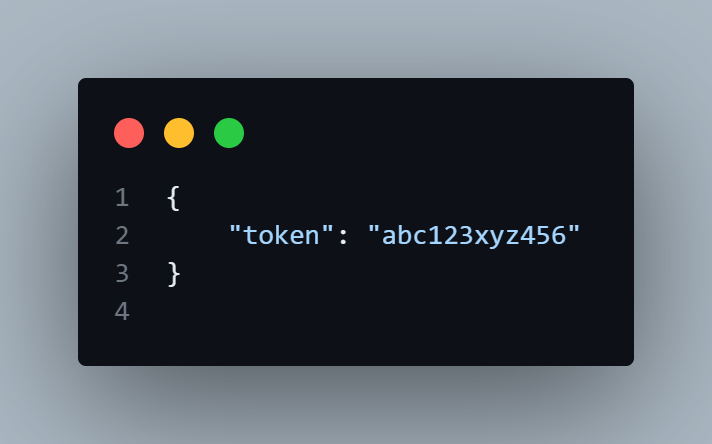
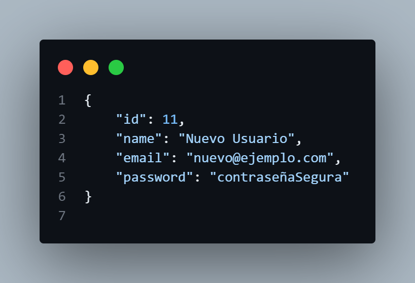
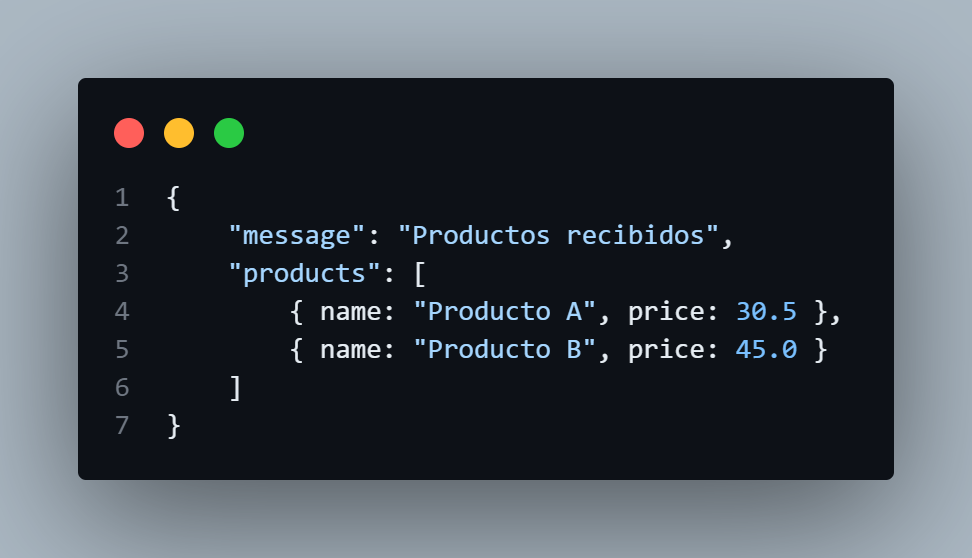
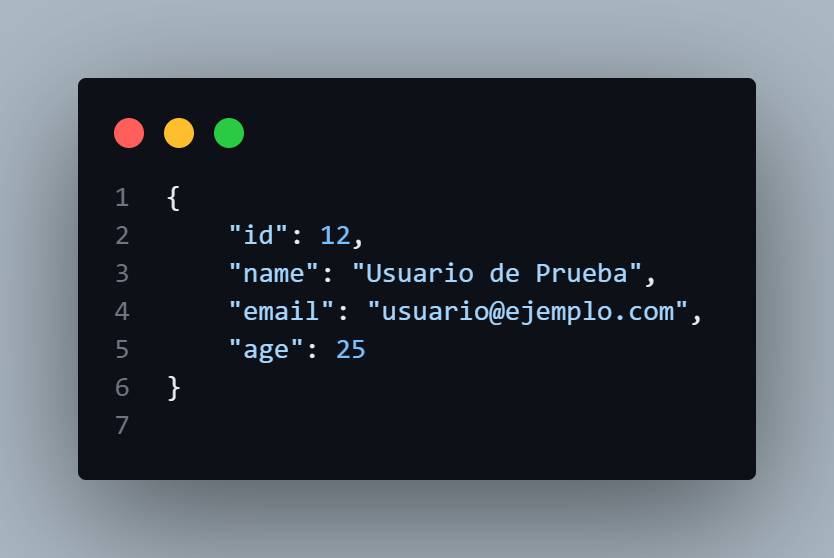

# Ejemplos POST requests Avanzados

## Ejercicios Avanzados

### Autenticación de Usuario
Necesitas autenticar a un usuario y obtener un token de acceso para futuras solicitudes a una API.

```javascript
    // Se define un objeto `credentials` que contiene el nombre de usuario y la contraseña del usuario
    const credentials = {
        username: "usuarioEjemplo",  // Nombre de usuario
        password: "contraseñaSegura"   // Contraseña del usuario
    };

    // Se hace una solicitud POST a la API de autenticación
    fetch('https://jsonplaceholder.typicode.com/auth/login', {
        method: 'POST',  // Se especifica el método HTTP como POST
        body: JSON.stringify(credentials),  // Se convierte el objeto `credentials` a una cadena JSON
        headers: {
            'Content-Type': 'application/json'  // Se especifica el tipo de contenido como JSON
        }
    })
    // Se maneja la respuesta de la API
    .then(response => {
        // Verifica si la respuesta es exitosa (código de estado 200-299)
        if (!response.ok) {
            throw new Error('Error en la autenticación');  // Si hay un error, se lanza una excepción
        }
        return response.json();  // Convierte la respuesta en JSON
    })
    .then(data => {
        console.log('Token de acceso:', data.token);  // Se imprime el token de acceso recibido
    })
    .catch(error => {
        console.error('Error de autenticación:', error);  // Se imprime el mensaje de error
    });

```
#### Explicación:

- Se define un objeto credentials que contiene las credenciales del usuario.
- Se realiza una solicitud POST a la API de autenticación, enviando las credenciales en el cuerpo de la solicitud en formato JSON.
- Se verifica si la respuesta es exitosa. Si no, se lanza un error.
- Si la respuesta es exitosa, se convierte la respuesta a formato JSON y se extrae el token de acceso.
- Se imprime el token en la consola o se maneja el error en caso de que ocurra.

#### Resultado


### Crear un Registro en una API
Necesitas permitir a un usuario crear un nuevo registro en tu sistema a través de una API.


```javascript
    // Se define un objeto `newUser` con los datos del nuevo usuario
    const newUser = {
        name: "Nuevo Usuario",  // Nombre del nuevo usuario
        email: "nuevo@ejemplo.com",  // Correo electrónico del nuevo usuario
        password: "contraseñaSegura"  // Contraseña del nuevo usuario
    };

    // Se hace una solicitud POST a la API para crear un nuevo usuario
    fetch('https://jsonplaceholder.typicode.com/users', {
        method: 'POST',  // Se especifica el método HTTP como POST
        body: JSON.stringify(newUser),  // Se convierte el objeto `newUser` a una cadena JSON
        headers: {
            'Content-Type': 'application/json'  // Se especifica el tipo de contenido como JSON
        }
    })
    .then(response => response.json())  // Convierte la respuesta en JSON
    .then(data => {
        console.log('Usuario creado:', data);  // Se imprime el nuevo usuario creado
    })
    .catch(error => {
        console.error('Error al crear el usuario:', error);  // Se imprime el mensaje de error
    });

```
#### Explicación:

- Se define un objeto newUser con la información del nuevo usuario que se quiere registrar.
- Se realiza una solicitud POST a la API para crear un nuevo usuario, enviando la información en formato JSON.
- Se maneja la respuesta de la API y se convierte a JSON.
- Se imprime el nuevo usuario creado o se maneja el error si ocurre.

#### Resultado


### Enviar un Array de Objetos:
Necesitas enviar un conjunto de datos como un array de objetos a la API para su procesamiento.


```javascript
    // Se define un array `products` con objetos que representan productos
    const products = [
        { name: "Producto A", price: 30.5 },  // Producto con nombre y precio
        { name: "Producto B", price: 45.0 },  // Otro producto
    ];

    // Se hace una solicitud POST para enviar el array de productos
    fetch('https://jsonplaceholder.typicode.com/products', {
        method: 'POST',  // Se especifica el método HTTP como POST
        body: JSON.stringify(products),  // Se convierte el array `products` a una cadena JSON
        headers: {
            'Content-Type': 'application/json'  // Se especifica el tipo de contenido como JSON
        }
    })
    .then(response => response.json())  // Convierte la respuesta en JSON
    .then(data => {
        console.log('Productos enviados:', data);  // Se imprime la respuesta de la API
    })
    .catch(error => {
        console.error('Error al enviar los productos:', error);  // Se imprime el mensaje de error
    });

```
#### Explicación:

- Se define un array de objetos products, donde cada objeto representa un producto con nombre y precio.
- Se realiza una solicitud POST para enviar el array de productos a la API.
- La respuesta se convierte a JSON y se imprime en la consola o se maneja el error si ocurre.

#### Resultado


### Enviar Datos con Validación
Antes de enviar datos a la API, necesitas validar que la información ingresada es correcta.

```javascript
   // Se define un objeto `userData` con los datos del usuario
    const userData = {
        name: "Usuario de Prueba",
        email: "usuario@ejemplo.com",
        age: 25
    };

    // Función de validación para asegurarse de que los datos son correctos
    function validateData(data) {
        if (!data.name || !data.email || data.age < 0) {
            throw new Error("Datos inválidos");  // Lanza un error si los datos no son válidos
        }
    }

    // Validar los datos antes de enviarlos
    try {
        validateData(userData);  // Llama a la función de validación
        // Si los datos son válidos, se realiza la solicitud POST
        fetch('https://jsonplaceholder.typicode.com/users', {
            method: 'POST',
            body: JSON.stringify(userData),  // Convierte el objeto a cadena JSON
            headers: {
                'Content-Type': 'application/json'  // Tipo de contenido como JSON
            }
        })
        .then(response => response.json())  // Convierte la respuesta en JSON
        .then(data => {
            console.log('Usuario creado:', data);  // Se imprime el nuevo usuario creado
        })
        .catch(error => {
            console.error('Error al crear el usuario:', error);  // Se imprime el mensaje de error
        });
    } catch (error) {
        console.error('Error de validación:', error);  // Manejo de errores de validación
    }

```
#### Explicación:

- Se define un objeto userData con la información del usuario.
- Se crea una función validateData que verifica si los datos son válidos.
- Se intenta validar los datos antes de enviarlos. Si son válidos, se realiza la solicitud POST.
- Se maneja la respuesta y los errores de la API, así como los errores de validación.

#### Resultado
